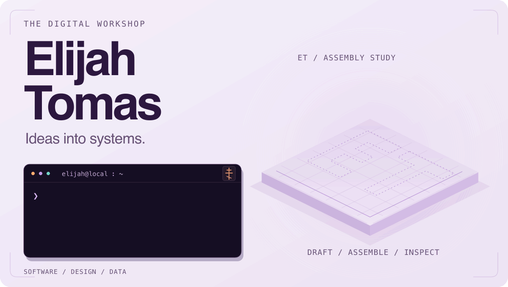

<picture>
  <source media="(prefers-reduced-motion: reduce) and (prefers-color-scheme: dark) and (max-width: 600px)" srcset="./assets/readme/hero-dark-compact.svg">
  <source media="(prefers-reduced-motion: reduce) and (prefers-color-scheme: dark)" srcset="./assets/readme/hero-dark.svg">
  <source media="(prefers-reduced-motion: reduce) and (max-width: 600px)" srcset="./assets/readme/hero-light-compact.svg">
  <source media="(prefers-reduced-motion: reduce)" srcset="./assets/readme/hero-light.svg">
  <source type="image/webp" media="(prefers-color-scheme: dark) and (max-width: 600px)" srcset="./assets/readme/hero-dark-compact.webp">
  <source type="image/webp" media="(prefers-color-scheme: dark)" srcset="./assets/readme/hero-dark.webp">
  <source type="image/webp" media="(max-width: 600px)" srcset="./assets/readme/hero-light-compact.webp">
  <source type="image/webp" srcset="./assets/readme/hero-light.webp">
  <source media="(prefers-color-scheme: dark) and (max-width: 600px)" srcset="./assets/readme/hero-dark-compact.gif">
  <source media="(prefers-color-scheme: dark)" srcset="./assets/readme/hero-dark.gif">
  <source media="(max-width: 600px)" srcset="./assets/readme/hero-light-compact.gif">
  
</picture>

# Hi, I'm Elijah.

I design and maintain software for client services, publishing, research, and simulation. Most of the source is private; the projects below show what each application does.

##  Selected projects

###  Tomas Financial

CLIENT SERVICES · PRIVATE SOURCE

A portal for a bookkeeping and tax practice, with separate client and staff views for document requests, financial reports, messages, and billing.

**Focus:** client service · document handoffs · billing 
[Visit Tomas Financial ↗](https://www.tomasfinancial.com/)

###  NET Marketing Studio

CONTENT AUTOMATION · PRIVATE SOURCE

Produces posts, articles, newsletters, images, and video from founder notes and podcasts. Source material and brand guidance follow each content pack through generation, review, and export.

**Focus:** AI-assisted publishing · media generation · editorial review

###  Thought Compiler

REASONING TOOLS · PRIVATE SOURCE

Extracts claims from prose, applies probabilistic and deductive reasoning, and compares alternative models. Exported proof bundles let readers inspect the steps behind a conclusion.

**Focus:** argument extraction · model comparison · proof export

###  Pennant

BASEBALL INTELLIGENCE · PRIVATE SOURCE

Estimates baseball player skills with Bayesian models, simulates games and seasons, and explores roster changes. Forecast evaluation keeps uncertainty visible alongside predictions.

**Tools and methods:** Python · Bayesian modeling · Monte Carlo simulation

## Further projects

PRIVATE SOURCE · ADDITIONAL PROJECTS

**Apps and experiences**

- **VALA:** Mobile tarot, card spreads, reading history, and a ritual journal.
- **Meridian:** Guided reading pathways across philosophy, history, economics, and related fields.
- **Masterpiece Minerals:** A mineral and crystal website with specimen galleries, artist features, and content editing.
- **Personal Portfolio:** A personal website with a project index and an overview of my businesses and approach.

**Games and simulations**

- **Leviathan:** A political strategy prototype where decisions face incomplete information and institutional resistance.
- **Three Tricks:** A Python card game combining bidding, trick-taking, poker hands, and AI opponents.

**Development tools**

- **Project Foundry:** Utilities for gathering context, selecting checks, and reviewing AI-assisted code changes.
- **Tomas Operations Console:** A local, read-only dashboard for progress, pending decisions, and supporting evidence.

<picture>
  <source media="(prefers-reduced-motion: reduce) and (prefers-color-scheme: dark) and (max-width: 600px)" srcset="./assets/readme/contributions-dark-compact-still.svg">
  <source media="(prefers-reduced-motion: reduce) and (prefers-color-scheme: dark)" srcset="./assets/readme/contributions-dark-still.svg">
  <source media="(prefers-reduced-motion: reduce) and (max-width: 600px)" srcset="./assets/readme/contributions-light-compact-still.svg">
  <source media="(prefers-reduced-motion: reduce)" srcset="./assets/readme/contributions-light-still.svg">
  <source media="(prefers-color-scheme: dark) and (max-width: 600px)" srcset="./assets/readme/contributions-dark-compact.svg">
  <source media="(prefers-color-scheme: dark)" srcset="./assets/readme/contributions-dark.svg">
  <source media="(max-width: 600px)" srcset="./assets/readme/contributions-light-compact.svg">
  
</picture>

<a href="https://github.com/elijahtomas87">View contribution history on GitHub ↗</a>

##  My approach

- **Clarify the problem.** Decide who it is for and what needs to change.
- **Make a prototype.** Put the main workflow into a form I can try.
- **Check the result.** Test assumptions, fix failures, and simplify the design.

---

<a href="./assets/readme/static.md">View without animation</a>
